# Пояснительная записка к проекту «Ассистент лектора»

---
## Введение

**Актуальность проблемы**  
Современные лекционные занятия в высших учебных заведениях нередко сталкиваются с проблемой доступности учебного материала: студенты в больших аудиториях не всегда могут разглядеть слайды на проекторе, у части аудитории отсутствует возможность делать снимки экрана или вести конспект в режиме реального времени. Помимо этого, традиционный формат лекции исключает удобный механизм обратной связи — студент вынужден перебивать лектора или откладывать вопрос «на потом», что снижает эффективность усвоения материала.

С широким распространением мессенджера Telegram и его открытого Bot API появилась возможность создать инструмент, органично встроенный в рабочий процесс преподавателя: надстройку для Microsoft PowerPoint, автоматически транслирующую слайды студентам и организующую сбор вопросов без прерывания лекции.

В связи с этим была сформулирована цель проекта:
> **Разработать программную систему «Ассистент лектора» для интерактивного сопровождения лекционных занятий, обеспечивающую автоматическую трансляцию слайдов PowerPoint студентам через мессенджер Telegram, сбор вопросов в реальном времени и аналитику взаимодействия аудитории.**

Для достижения поставленной цели необходимо решить следующие задачи **в соответствии с методологией Software Engineering**:
1. **Сбор и спецификация требований**: Провести выявление, классификацию и формализацию функциональных и нефункциональных требований к системе согласно руководству SWEBOK (Software Requirements KA) с разделением на роли Лектора и Студента.
2. **Проектирование архитектуры и модели данных**: Разработать многоуровневую клиент-серверную архитектуру взаимодействия компонентов (Hexagonal Architecture), спроектировать ER-схему данных и сценарии динамического взаимодействия (Sequence Diagrams).
3. **Конструирование и тестирование**: Реализовать серверную часть (Java 21 / Spring Boot 4) с встроенной СУБД H2, надстройку PowerPoint (Office Add-in JS / webpack), Java Swing лаунчер с MSI-установщиком (jpackage + WiX), покрыть ключевые компоненты тестами и разработать документацию.

---

## 1. Определение программного продукта

### 1.1 Описание проблемы
**Проблема:** отсутствие удобного инструмента, позволяющего преподавателю в режиме реального времени уведомлять студентов о текущем слайде презентации и организовывать обратную связь непосредственно во время лекции, не прерывая её ход.

**Воздействует на:** преподавателей высших и средних учебных заведений, проводящих лекции с использованием PowerPoint; студентов, участвующих в лекции очно или дистанционно.

**Результатом чего является** — студенты не могут следить за слайдами при плохой видимости экрана или при дистанционном участии; нет удобного способа задавать вопросы, не перебивая лектора; преподаватель не видит, насколько материал понятен аудитории и кто из студентов активно следит за лекцией.

**Выигрыш от ПП:**
- мгновенное уведомление студентов о смене слайда с возможностью запросить его изображение через Telegram-бот; 
- возможность задавать вопросы анонимно прямо в чате без прерывания лекции; 
- аналитика активности студентов и история вопросов для преподавателя.

### 1.2 Цель программного продукта
Система предназначена для применения в учебных заведениях — университетах, колледжах и школах, — в которых лекционные занятия проводятся с использованием Microsoft PowerPoint. ПС одинаково применимо как при очном формате (все студенты присутствуют в аудитории), так и при смешанном (часть аудитории участвует дистанционно через мобильное устройство).

Входные данные поступают от следующих систем/пользователей:
- Лектор — формирует управляющие воздействия через панель надстройки PowerPoint: создаёт сессию лекции, инициирует смену слайда, завершает занятие
- Студент — взаимодействует с системой через Telegram-бот: подключается к лекции и запрашивает изображение текущего слайда
- Microsoft PowerPoint — является источником событий смены слайда и предоставляет SVG-представление текущего слайда через Office.js API

Результаты используют:

- Студент — получает в Telegram уведомления о смене слайда и изображения слайдов по собственному запросу
- Лектор — использует аналитические данные системы: список поступивших вопросов, состав подключённой аудитории, статистику запросов слайдов
- Telegram — выступает транспортным каналом для доставки уведомлений и изображений от сервера к студентам

Сторонние системы/сервисы, участвующие в процессе обработки данных:

- Telegram Bot API — обеспечивает двустороннее взаимодействие между сервером и студентами: доставку уведомлений, передачу изображений слайдов и приём вопросов
- Microsoft PowerPoint / Office Add-in API — предоставляет программный интерфейс для встраивания надстройки в среду лектора и получения данных о текущем слайде
- Windows Certificate Store — системное хранилище доверенных сертификатов, необходимое для установления защищённого HTTPS-соединения между надстройкой и сервером
---

### 1.3 Контекст использования
Иерархия заинтересованных лиц (метод опорных точек зрения):

```
Пользователи PresAssistant
├── Лектор
│   ├── Управляет сессией лекции
│   ├── Транслирует слайды студентам
│   ├── Работает с вопросами аудитории
│   └── Завершает лекцию
├── Студент
│   ├── Подключается к лекции через Telegram
│   ├── Запрашивает слайды
│   └── Задаёт вопросы лектору
└── IT-Администратор
    ├── Устанавливает и настраивает систему
    ├── Управляет SSL-сертификатом
    └── Регистрирует надстройку в Office
```

**Лектор** — основной пользователь, ведущий лекцию. Работает в PowerPoint, не переключается между приложениями. Технический уровень: средний (умеет пользоваться надстройками Office).

**Студент** — пассивный участник. Использует только Telegram. Технический уровень: базовый (умеет пользоваться мессенджером).

**IT-Администратор** — выполняет однократную установку и настройку системы. Технический уровень: выше среднего (понимает SSL, реестр Windows, PowerShell).

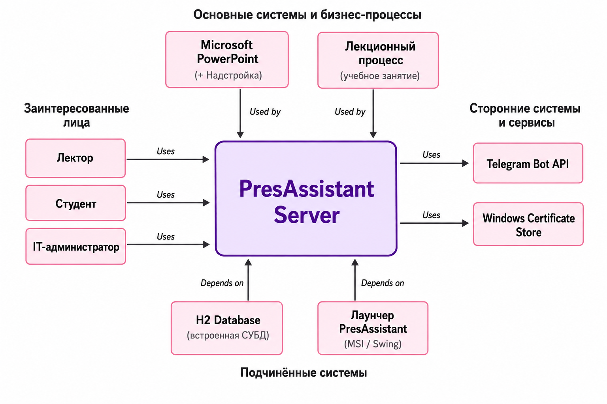

___
## 2. Функциональное назначение программного средства

### 2.1 Классы решаемых задач

В соответствии со сводом знаний **SWEBOK (Software Engineering Body of Knowledge)**, разрабатываемая система относится к классу распределённых информационно-коммуникационных систем реального времени и решает следующие классы задач:

- **Задачи трансляции и доставки контента (Content Delivery)**: Автоматическая доставка изображений слайдов PowerPoint всем подключённым студентам в режиме реального времени при смене слайда лектором.
- **Задачи сбора и обработки обратной связи (Feedback Collection)**: Приём текстовых вопросов от студентов через Telegram-бот, их агрегация и отображение в панели лектора с возможностью управления.
- **Задачи аналитики и мониторинга (Analytics & Monitoring)**: Отслеживание активности студентов — кто и сколько раз запрашивал слайды, количество подключённых участников, история взаимодействия.
- **Задачи автоматизации развёртывания (Deployment Automation)**: Упаковка всей системы в единый Windows MSI-установщик с автоматической регистрацией SSL-сертификата и надстройки Office.

> Анализ прототипов и конкурентов приведен в таблице 1.

#### Таблица 1. Анализ конкурирующих решений

| Проблема | Сегмент рынка | Mentimeter | Slido | Microsoft Teams | Приоритет |
| :--- | :---: | :---: | :---: | :---: |:---------:|
| Уведомление студентов о текущем слайде в реальном времени | U, XS, S | — | — | + |     e     |
| Интеграция с PowerPoint без смены среды лектора | U, XS | — | + | + |     e     |
| Доступ студентов без регистрации и установки приложений | U, XS, S | + | + | — |     e     |
| Работа через мессенджер Telegram | U | — | — | — |     u     |
| Работа без корпоративных аккаунтов и VPN | U, XS | + | — | — |     u     |
| Локальное хранение данных (без облака провайдера) | XS | — | — | — |     d     |
| Сбор анонимных вопросов от студентов | U, XS, S | + | + | — |     u     |
| Аналитика активности студентов по слайдам | S, M | + | + | + |     u     |
| Бесплатное использование без ограничений | U, XS | — | — | — |     d     |

> Сегменты: U — обычные пользователи (преподаватели), XS — малые учреждения до 10 чел., S — 10–25, M — 25–250.  
> Приоритеты: e — обязательно (essential), u — полезно (useful), d — желательно (desirable).

**Вывод:** Mentimeter и Slido закрывают задачу сбора вопросов, но не предоставляют уведомлений о слайдах и требуют регистрации. Microsoft Teams решает задачу трансляции, но требует корпоративной подписки и полной смены инструментария. Ни один из конкурентов не поддерживает интеграцию с Telegram — наиболее популярным мессенджером в студенческой среде. Ключевые идеи из анализа, применённые в PresAssistant: анонимные вопросы от Mentimeter/Slido, интеграция с PowerPoint от Teams, собственное преимущество — Telegram как канал без регистрации.

---

### 2.2 Функциональные требования (в соответствии с SWEBOK KA «Software Requirements»)

Согласно классификации SWEBOK, функциональные требования разделяются на **Пользовательские требования (User Requirements)** — возможности на уровне взаимодействия с системой для двух акторов (Лектор и Студент), и **Системные требования (System Requirements)** — детальные действия программных модулей.

#### Разделение ролей акторов:

1. **Лектор**: Управляет сессией лекции через надстройку PowerPoint. Запускает лекцию, транслирует слайды, просматривает вопросы, управляет составом аудитории, рассылает сообщения, завершает лекцию.
2. **Студент**: Подключается к лекции через Telegram-бота по QR-коду или названию. Получает слайды, задаёт вопросы текстом.

#### Таблица 2. Спецификация функциональных требований (SWEBOK Traceability Matrix)

| Идентификатор | Класс требования | Описание требования |
| :--- | :--- | :--- |
| **FR-UR-01** | User Requirement | Лектор должен иметь возможность создать именованную сессию лекции с выбором режима участия (анонимный / поимённый). |
| **FR-UR-02** | User Requirement | При смене слайда студентам должно автоматически отправляться уведомление с номером текущего слайда. |
| **FR-UR-03** | User Requirement | Лектор должен иметь возможность просматривать список вопросов студентов в реальном времени и удалять отдельные вопросы. |
| **FR-UR-04** | User Requirement | Лектор должен иметь возможность видеть список подключённых студентов и принудительно отключать участников. |
| **FR-UR-05** | User Requirement | Лектор должен иметь возможность рассылать произвольное текстовое сообщение всем подключённым студентам. |
| **FR-UR-06** | User Requirement | Лектор должен видеть QR-код для быстрого подключения студентов и ссылку на Telegram-бота. |
| **FR-UR-07** | User Requirement | Лектор должен видеть аналитику: кто из студентов и сколько раз запрашивал слайды за время лекции. |
| **FR-UR-08** | User Requirement | Студент должен иметь возможность подключиться к активной лекции через QR-код или по её названию без регистрации. |
| **FR-UR-09** | User Requirement | Студент должен автоматически получать уведомление с номером слайда при каждой его смене лектором. |
| **FR-UR-10** | User Requirement | Студент должен иметь возможность запросить изображение текущего слайда по кнопке в боте или командой `/slide`. |
| **FR-UR-11** | User Requirement | Студент должен иметь возможность задать вопрос лектору, отправив текстовое сообщение боту во время лекции. |
| **FR-SR-01** | System Requirement | **Модуль LectureService** обязан создавать уникальную сессию лекции, сохранять её в СУБД и возвращать идентификатор для генерации QR-кода. |
| **FR-SR-02** | System Requirement | При получении события смены слайда сервер обязан разослать всем активным подписчикам уведомление с номером текущего слайда. При запросе `/slide` — захватить SVG, конвертировать в PNG и отправить изображение запросившему студенту. |
| **FR-SR-03** | System Requirement | **Модуль TelegramNotificationAdapter** обязан при получении команды `/start {lectureId}` зарегистрировать нового студента в БД и отправить ему подтверждение подключения. |
| **FR-SR-04** | System Requirement | При поимённом режиме лекции система обязана запросить у студента Ф.И.О. перед подключением и сохранить его в таблице студентов. |
| **FR-SR-05** | System Requirement | **Модуль StudentService** обязан принимать текстовые сообщения от подключённых студентов как вопросы и сохранять их в БД с привязкой к сессии лекции и идентификатору студента. |
| **FR-SR-06** | System Requirement | При завершении лекции система обязана разослать уведомление всем подключённым студентам и закрыть сессию в СУБД. |
| **FR-SR-07** | System Requirement | **Модуль InMemoryAnalyticsAdapter** обязан фиксировать каждый запрос слайда студентом и предоставлять агрегированную статистику по запросу лектора. |

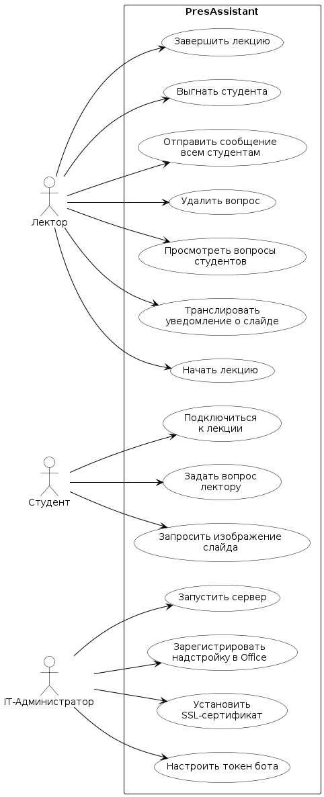

---
### 2.3 Сценарии использования

#### UC-1: Начать лекцию

**Название:** Начать лекцию  
**Актор:** Лектор  
**Предусловие:** Сервер запущен (зелёный статус в лаунчере); надстройка зарегистрирована и открыта в PowerPoint; презентация открыта.

**Основной поток:**
1. Лектор вводит название лекции в поле надстройки
2. Лектор выбирает режим участия (анонимный / поимённый)
3. Лектор нажимает «Начать лекцию»
4. Система создаёт сессию в БД и возвращает уникальный ID
5. Система генерирует QR-код с Telegram deep link
6. Надстройка переходит к экрану активной лекции и отображает QR-код
7. Лектор показывает QR-код аудитории (через проектор)

**Альтернативный поток А1 — сервер недоступен:**  
3а. Система отображает ошибку «Ошибка сервера» → лектор проверяет статус лаунчера и повторяет попытку.

**Альтернативный поток А2 — название не введено:**  
3а. Система отображает сообщение «Введите название лекции» → лектор вводит название.

**Постусловие:** Сессия лекции создана и активна; студенты могут подключиться по QR-коду.

---

#### UC-2: Транслировать уведомление о слайде

**Название:** Транслировать уведомление о слайде  
**Актор:** Лектор  
**Предусловие:** Лекция активна (UC-1 выполнен); хотя бы один студент подключён.

**Основной поток:**
1. Лектор переходит на следующий слайд в PowerPoint
2. Office.js фиксирует событие смены слайда
3. Надстройка получает номер текущего слайда
4. Надстройка захватывает SVG-изображение слайда и конвертирует в PNG
5. Надстройка отправляет изображение и номер слайда на сервер
6. Сервер рассылает уведомление с номером слайда всем подключённым студентам
7. Надстройка отображает статус «Слайд N отправлен ✓»

**Альтернативный поток А1 — ручная отправка:**  
1а. Лектор отключает «Автоматическую отправку» → при смене слайда уведомление не рассылается → лектор нажимает «Отправить слайд студентам» вручную → далее шаги 4–7.

**Альтернативный поток А2 — сбой отправки:**  
6а. Сервер недоступен → надстройка показывает «Ошибка отправки» → лектор может повторить вручную.

**Постусловие:** Все подключённые студенты получили уведомление с номером текущего слайда; изображение сохранено на сервере для запросов по `/slide`.

---

#### UC-3: Просмотреть и удалить вопрос студента

**Название:** Просмотреть и удалить вопрос студента  
**Актор:** Лектор  
**Предусловие:** Лекция активна; студент задал хотя бы один вопрос.

**Основной поток:**
1. Лектор переходит на вкладку «Вопросы» в панели надстройки
2. Система отображает список вопросов (новые — сверху) с именем студента
3. Лектор читает вопрос и отвечает устно
4. Лектор нажимает «✕» рядом с вопросом
5. Система удаляет вопрос из списка и БД

**Альтернативный поток А1 — нет вопросов:**  
2а. Список пуст → отображается «Вопросов пока нет».

**Постусловие:** Вопрос удалён из системы; счётчик вопросов на вкладке уменьшился.

---

#### UC-4: Подключиться к лекции

**Название:** Подключиться к лекции  
**Актор:** Студент  
**Предусловие:** Лекция активна; у студента установлен Telegram.

**Основной поток:**
1. Студент открывает камеру и сканирует QR-код на экране лектора
2. Telegram открывается с предзаполненной командой `/start {lectureId}`
3. Студент нажимает «Старт»
4. Бот регистрирует студента в БД и присылает подтверждение с названием лекции

**Альтернативный поток А1 — поимённый режим:**  
4а. Бот запрашивает Ф.И.О. → студент вводит имя → система сохраняет → бот присылает подтверждение.

**Альтернативный поток А2 — лекция завершена:**  
4а. Бот сообщает «Лекция уже завершена» → студент не подключается.

**Альтернативный поток А3 — подключение вручную:**  
1а. Студент находит бота в поиске Telegram → отправляет `/start` → вводит название лекции → далее шаги 4–5.

**Постусловие:** Студент зарегистрирован в сессии; будет получать уведомления о слайдах.

---

#### UC-5: Запросить изображение слайда

**Название:** Запросить изображение слайда  
**Актор:** Студент  
**Предусловие:** Студент подключён к активной лекции (UC-4 выполнен); лектор уже показал хотя бы один слайд.

**Основной поток:**
1. Студент получает уведомление: «Лектор перешёл на слайд N»
2. Студент нажимает кнопку «Получить слайд» в боте (или отправляет `/slide`)
3. Сервер извлекает последнее сохранённое изображение текущего слайда
4. Бот отправляет PNG-изображение студенту в Telegram

**Альтернативный поток А1 — слайд ещё не загружен:**  
3а. Изображение отсутствует на сервере → бот отвечает «Слайд пока недоступен».

**Постусловие:** Студент получил изображение текущего слайда в чате с ботом.

---

#### UC-6: Задать вопрос лектору

**Название:** Задать вопрос лектору  
**Актор:** Студент  
**Предусловие:** Студент подключён к активной лекции.

**Основной поток:**
1. Студент набирает вопрос в чате с ботом и отправляет
2. Сервер получает сообщение, идентифицирует студента по `chat_id`
3. Система сохраняет вопрос в БД с привязкой к сессии и текущему слайду
4. Бот подтверждает: «Ваш вопрос отправлен лектору»
5. В панели лектора появляется новый вопрос, счётчик вкладки увеличивается

**Альтернативный поток А1 — студент выгнан:**  
2а. Флаг `kicked = true` → бот игнорирует сообщение.

**Постусловие:** Вопрос сохранён в БД и отображается в панели лектора.

---

#### UC-7: Установить систему

**Название:** Установить систему  
**Актор:** IT-Администратор  
**Предусловие:** Компьютер работает под управлением Windows 10/11; установлен Microsoft Office 2016+; есть права администратора.

**Основной поток:**
1. Администратор запускает `PresAssistant-1.0.0.msi`
2. Мастер установки предлагает выбрать папку → администратор нажимает «Установить»
3. Администратор открывает лаунчер, вводит токен Telegram-бота
4. Администратор нажимает «Запустить» на вкладке «Управление»
5. Администратор переходит на вкладку «Установка» → нажимает «Установить сертификат»
6. Система устанавливает SSL-сертификат в `LocalMachine\Root`
7. Администратор нажимает «Зарегистрировать надстройку»
8. Система скачивает манифест и прописывает надстройку в реестре Office
9. Администратор перезапускает PowerPoint

**Альтернативный поток А1 — UAC отключён (EnableLUA=0):**  
5а. Система определяет отключённый UAC → запускает скрипт напрямую без повышения прав.

**Альтернативный поток А2 — Office не найден:**  
8а. Скрипт не находит ключ реестра `HKCU:\SOFTWARE\Microsoft\Office\16.0\WEF` → выводит предупреждение «Office не найден».

**Постусловие:** Сертификат установлен; надстройка доступна в PowerPoint через «Вставка → Мои надстройки → Общая папка».

---
### 2.4 Нефункциональные требования (Quality Attributes по SWEBOK / ISO/IEC 25010)

В соответствии с классификацией атрибутов качества ПО по SWEBOK и международному стандарту **ISO/IEC 25010**, к системе предъявляются следующие нефункциональные требования:

#### 1. Производительность и эффективность (Performance Efficiency)
- **Временные характеристики (Time Behaviour)**: Время от события смены слайда до доставки изображения студенту не должно превышать **5 секунд** при стабильном интернет-соединении. Панель надстройки должна обновлять список вопросов не реже чем раз в **10 секунд** в автоматическом режиме.
- **Utilisation**: Серверный процесс в режиме ожидания не должен потреблять более 100 МБ оперативной памяти.

#### 2. Надёжность (Reliability)
- **Восстанавливаемость**: При временной недоступности Telegram Bot API (сетевые сбои) система не должна аварийно завершаться — ошибки отправки логируются, повторные попытки осуществляются автоматически.
- **Отказоустойчивость**: При работе в режиме показа слайдов (`SlideShow`) надстройка должна переключаться в режим опроса (polling) текущего слайда каждые 800 мс, компенсируя отсутствие событий `DocumentSelectionChanged`.

#### 3. Безопасность (Security)
- **Конфиденциальность**: Рассылка уведомлений о слайдах и изображений по запросу осуществляется только студентам с активным статусом подключения к текущей сессии лекции.
- **Защита канала**: Соединение между надстройкой PowerPoint и сервером защищено протоколом HTTPS/TLS с использованием самоподписанного сертификата, установленного в доверенное хранилище Windows.
- **Изоляция данных**: Данные каждой сессии лекции (вопросы, студенты, слайды) изолированы и недоступны из других сессий.

#### 4. Удобство эксплуатации (Usability & Operability)
- **Простота установки**: Вся система, включая встроенную JRE, упакована в единый MSI-установщик. Установка не требует предварительной настройки Java, Node.js или баз данных.
- **Первичная настройка**: Процедура регистрации SSL-сертификата и надстройки Office реализована в виде пошаговых кнопок в интерфейсе лаунчера без обращения к командной строке.

#### 5. Переносимость и совместимость (Portability & Compatibility)
- **Версии Office**: Надстройка совместима с Microsoft Office 2016, 2019, 2021 и Microsoft 365 (версия надстройки API: PresentationAPI 1.1+).
- **Автономность**: База данных H2 встроена в сервер и не требует отдельной СУБД. Все данные хранятся локально в `%USERPROFILE%\.presassistant\`.

---

## 3. Проектная часть

### 3.1 Архитектура приложения

Для обеспечения чёткого разделения ответственности, высокой тестируемости и независимости доменной логики от инфраструктуры был выбран архитектурный стиль **Hexagonal Architecture (Ports & Adapters)**, предложенный Алистером Кокберном.

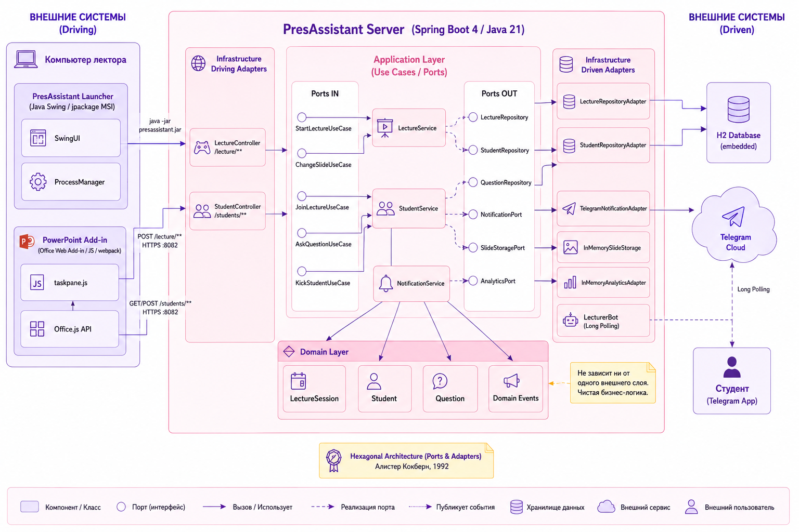

#### Распределение функциональности по компонентам:

1. **Лаунчер (`LauncherApp`)**: Java Swing GUI-приложение, упакованное в MSI. Управляет жизненным циклом Spring Boot процесса, хранит конфигурацию (`~/.presassistant/config.properties`), выполняет первичную установку сертификата и регистрацию надстройки.

2. **Сервер (`PresAssistantApplication`)**: Spring Boot 4 приложение, реализующее бизнес-логику через слои Application, Domain и Infrastructure:
   - **Domain**: Модели `LectureSession`, `Student`, `Question`, доменные события
   - **Application**: Use Case интерфейсы и сервисы (`LectureService`, `StudentService`, `NotificationService`)
   - **Infrastructure**: REST-контроллеры, JPA-адаптеры, Telegram-адаптер, WebSocket-адаптер

3. **Надстройка PowerPoint (`pres-assistant-addin`)**: Office Web Add-in на JavaScript, собранный через webpack 5. Взаимодействует с PowerPoint через Office.js API и с сервером через REST/HTTPS.

4. **Telegram-бот (`LecturerBot`)**: Реализован на Telegram Bots API (Long Polling). Принимает команды студентов, рассылает изображения слайдов и уведомления.

---

### 3.2 Проектирование пользовательского интерфейса

#### Интерфейс лаунчера

Лаунчер реализован как трёхвкладочное приложение с применением библиотеки FlatLaf (плоский дизайн, акцентный цвет `#632e9e`):

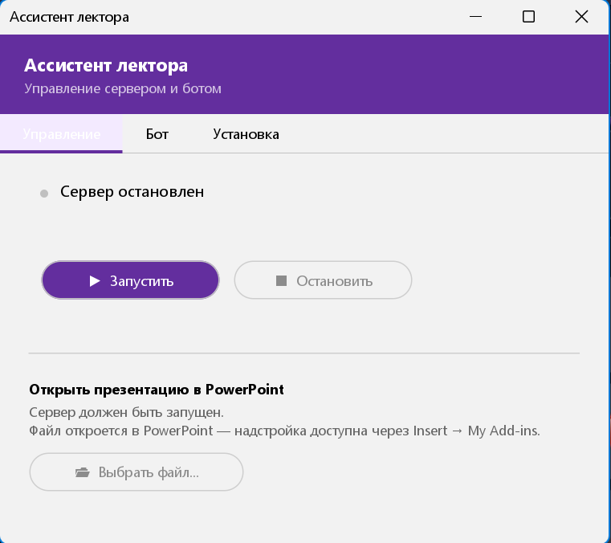
Вкладка "Управление" лаунчера
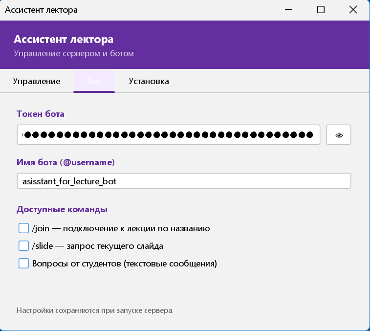
Вкладка "Бот" лаунчера
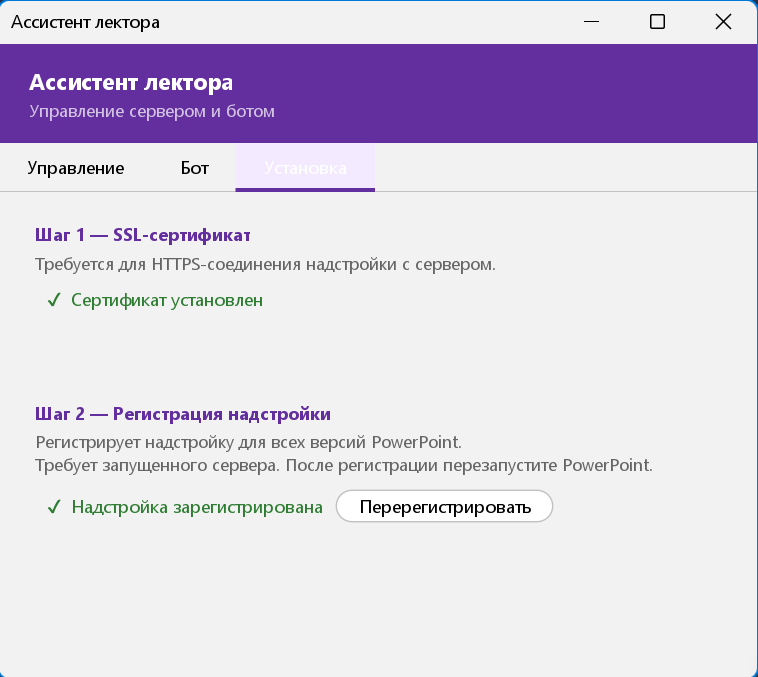
Вкладка "Установка" лаунчера

- **Вкладка «Управление»**: Индикатор статуса сервера, кнопки Запустить / Остановить, выбор файла презентации.
- **Вкладка «Бот»**: Ввод токена бота, имени (@username), переключение доступных команд.
- **Вкладка «Установка»**: Пошаговые инструкции с кнопками установки сертификата и регистрации надстройки.

#### Интерфейс надстройки PowerPoint

Надстройка отображается в боковой панели PowerPoint и включает два экрана:

**Экран настройки** (до начала лекции):
- Поле ввода названия лекции
- Переключатель режима участия (анонимный / поимённый)
- Кнопка «Начать лекцию»

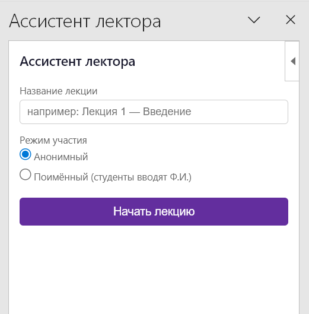

**Экран активной лекции**:
- Строка статуса (название лекции, кнопка завершения)
- Текущий номер слайда и статус синхронизации
- Переключатель автоматической отправки
- Поле рассылки сообщений
- Четыре вкладки: **QR-код**, **Вопросы**, **Студенты**, **Аналитика**

  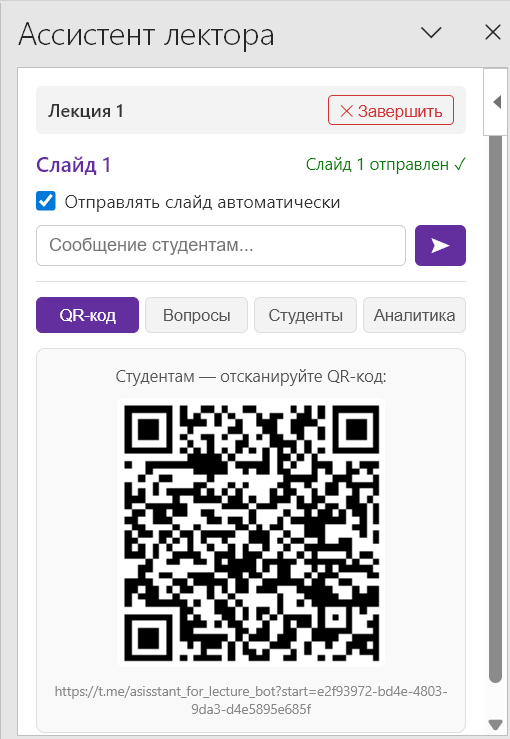
---

### 3.3 Модель данных

Хранение информации организовано в реляционной СУБД H2 (embedded). Миграции управляются через Flyway. База данных состоит из 3 таблиц.

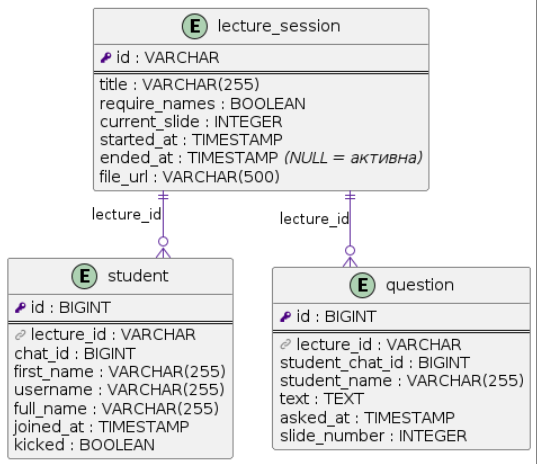

#### Описание сущностей

##### 1. Таблица `lecture_session` (Сессии лекций)

| Название столбца | Тип данных | Ключ | Nullable | Описание |
| :--- | :--- | :---: | :---: | :--- |
| `id` | `VARCHAR` | **PK** | Нет | UUID сессии (используется в QR-коде и ссылке бота) |
| `title` | `VARCHAR(255)` | — | Нет | Название лекции, введённое лектором |
| `require_names` | `BOOLEAN` | — | Нет | Флаг поимённого режима |
| `current_slide` | `INTEGER` | — | Да | Номер текущего активного слайда |
| `started_at` | `TIMESTAMP` | — | Нет | Дата и время начала лекции |
| `ended_at` | `TIMESTAMP` | — | Да | Дата и время завершения (`NULL` — лекция активна) |
| `file_url` | `VARCHAR(500)` | — | Да | Путь к файлу презентации на компьютере лектора |

##### 2. Таблица `student` (Студенты)

| Название столбца | Тип данных | Ключ | Nullable | Описание |
| :--- | :--- | :---: | :---: | :--- |
| `id` | `BIGINT` | **PK** | Нет | Автоинкрементный суррогатный ключ |
| `lecture_id` | `VARCHAR` | **FK** | Нет | Ссылка на `lecture_session.id` |
| `chat_id` | `BIGINT` | — | Нет | Уникальный идентификатор чата в Telegram |
| `first_name` | `VARCHAR(255)` | — | Да | Имя пользователя в Telegram |
| `username` | `VARCHAR(255)` | — | Да | @username в Telegram |
| `full_name` | `VARCHAR(255)` | — | Да | Ф.И.О. студента (заполняется в поимённом режиме) |
| `joined_at` | `TIMESTAMP` | — | Нет | Время подключения к лекции |
| `kicked` | `BOOLEAN` | — | Нет | Флаг отключения студента лектором |

##### 3. Таблица `question` (Вопросы студентов)

| Название столбца | Тип данных | Ключ | Nullable | Описание |
| :--- | :--- | :---: | :---: | :--- |
| `id` | `BIGINT` | **PK** | Нет | Автоинкрементный суррогатный ключ |
| `lecture_id` | `VARCHAR` | **FK** | Нет | Ссылка на `lecture_session.id` |
| `student_chat_id` | `BIGINT` | — | Нет | `chat_id` студента, задавшего вопрос |
| `student_name` | `VARCHAR(255)` | — | Да | Имя студента на момент вопроса |
| `text` | `TEXT` | — | Нет | Текст вопроса |
| `asked_at` | `TIMESTAMP` | — | Нет | Дата и время получения вопроса |
| `slide_number` | `INTEGER` | — | Да | Номер слайда, на котором был задан вопрос |

---

### 3.4 Моделирование работы приложения

Взаимодействие компонентов системы приведено на диаграммах последовательности.

#### Сценарий «Запуск лекции и подключение студента»:

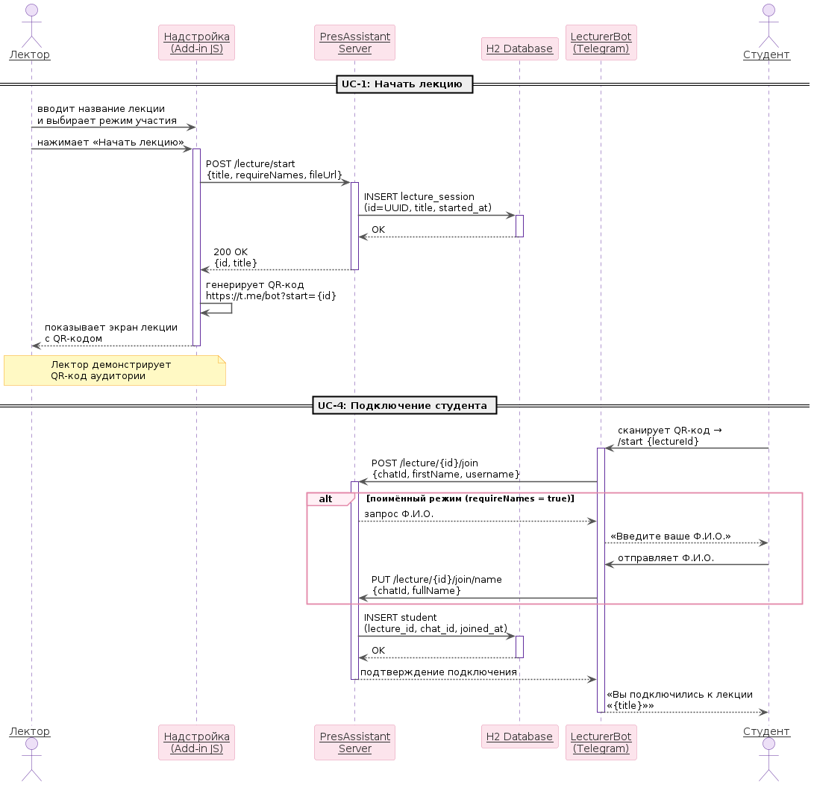

1. Лектор вводит название и нажимает «Начать лекцию» в надстройке
2. Надстройка отправляет `POST /lecture/start` на сервер
3. Сервер создаёт `LectureSession` в БД и возвращает `{id, title}`
4. Надстройка генерирует QR-код с deep link `https://t.me/bot?start={id}`
5. Студент сканирует QR-код → Telegram открывается с предзаполненной командой
6. Telegram-бот получает `/start {id}`, регистрирует студента в БД
7. Студент получает подтверждение подключения

#### Сценарий «Смена слайда и трансляция»:

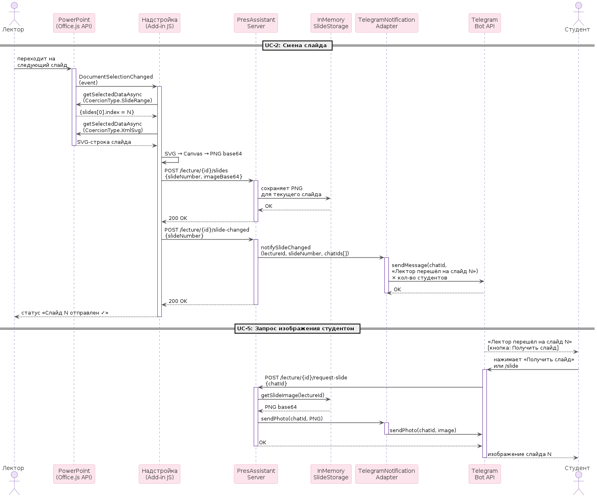

1. Лектор переходит на следующий слайд в PowerPoint
2. Office.js вызывает обработчик `onSlideChanged`
3. Надстройка вызывает `getSelectedDataAsync(SlideRange)` → получает номер слайда
4. Надстройка вызывает `getSelectedDataAsync(XmlSvg)` → получает SVG-изображение
5. SVG рендерится на canvas, конвертируется в PNG base64
6. Надстройка отправляет `POST /lecture/{id}/slides` с изображением (сохраняется на сервере)
7. Надстройка отправляет `POST /lecture/{id}/slide-changed` с номером слайда
8. Сервер вызывает `TelegramNotificationAdapter` → рассылает всем студентам **уведомление** с номером слайда
9. Студент, желающий увидеть слайд, нажимает кнопку в боте или отправляет `/slide`
10. Сервер отдаёт сохранённое изображение — студент получает PNG в Telegram

---

## 4. Конструирование программного продукта

В качестве среды разработки использована **IntelliJ IDEA 2023** (сервер, лаунчер и надстройка PowerPoint).

При разработке программного продукта использованы следующие языки программирования:
- **Java 21** — серверная логика (Spring Boot), лаунчер (Swing)
- **JavaScript (ES6+)** — надстройка PowerPoint (Office Add-in API)
- **SQL** — миграции БД (Flyway, диалект H2)
- **XML** — манифест надстройки Office (`manifest.xml`)
- **Kotlin DSL** — сборочные скрипты Gradle (`build.gradle.kts`)
- **PowerShell** — скрипты установки сертификата и регистрации надстройки
- **Markdown** — документация проекта

---

### 4.1 Диаграмма классов и их описание

Архитектурно серверный код разделён на пакеты в соответствии с Hexagonal Architecture:

```
by.presassistant/
├── domain/
│   ├── model/          LectureSession, Student, Question
│   └── event/          LectureStartedEvent, SlideChangedEvent, ...
├── application/
│   ├── port/in/        StartLectureUseCase, ChangeSlideUseCase, ...
│   ├── port/out/       LectureRepository, NotificationPort, ...
│   ├── command/        StartLectureCommand, JoinLectureCommand, ...
│   └── service/        LectureService, StudentService, NotificationService
└── infrastructure/
    ├── web/            LectureController, StudentController
    ├── persistence/    LectureRepositoryAdapter, StudentRepositoryAdapter
    ├── telegram/       LecturerBot, TelegramNotificationAdapter
    ├── websocket/      WebSocketNotificationAdapter
    └── storage/        InMemorySlideStorage, InMemoryAnalyticsAdapter
```

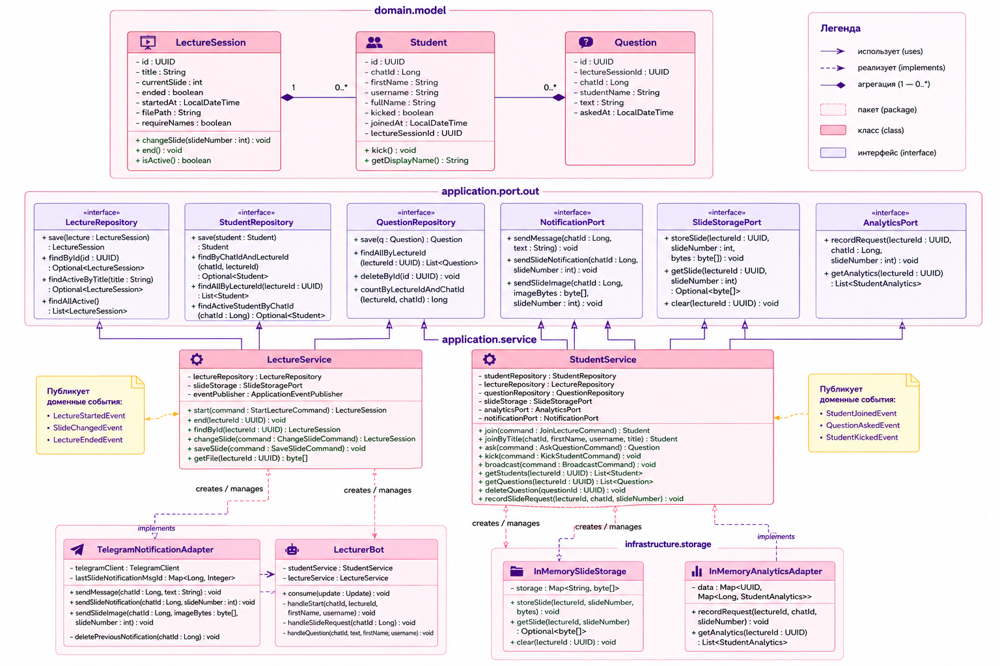

#### Описание ключевых классов:

- **`LectureService`**: Реализует use cases управления лекцией. Создаёт и завершает сессии, делегирует уведомления через `NotificationPort`. Использует аннотацию `@EventListener` для реакции на доменные события.

- **`StudentService`**: Управляет жизненным циклом студентов в сессии. Регистрирует подключения, обрабатывает вопросы, предоставляет данные для аналитики.

- **`LecturerBot`**: Наследник `TelegramLongPollingBot`. Обрабатывает входящие сообщения от студентов: команду `/start {lectureId}` для подключения, текстовые сообщения как вопросы, команду `/slide` для повторного запроса текущего слайда.

- **`TelegramNotificationAdapter`**: Адаптер порта `NotificationPort`. Рассылает изображения слайдов и текстовые уведомления студентам через Telegram Bot API, используя `chatId` из БД.

- **`LauncherApp`**: Java Swing приложение. Управляет дочерним процессом `presassistant.jar`, читает и пишет конфигурацию, проверяет статус UAC для корректного запуска скриптов установки.

- **`InMemoryAnalyticsAdapter`**: Реализует порт `AnalyticsPort` через `ConcurrentHashMap`. Хранит статистику запросов слайдов в оперативной памяти на время сессии.

---

### 4.2 Тестирование программного средства (в соответствии с SWEBOK KA «Software Testing»)

Согласно руководству **SWEBOK (Software Testing KA)**, критические компоненты бизнес-логики покрыты модульными тестами (Unit Tests) с использованием фреймворка **JUnit 5** и библиотеки моков **Mockito**. Тесты находятся в директории `src/test/java/by/presassistant`.

#### Класс тестов `LectureServiceTest`

Проверяет бизнес-логику управления сессиями лекций.

- `testStartLecture_createsSessionAndReturnsId()`: Верифицирует, что при вызове `startLecture()` сервис создаёт сессию с корректным заголовком, сохраняет её через `LectureRepository` и возвращает непустой идентификатор.
- `testStartLecture_sendsStartNotification()`: Проверяет, что после создания сессии вызывается `NotificationPort.sendMessage()` с корректными параметрами (через Mockito verify).
- `testEndLecture_setsEndedAt()`: Проверяет, что `endLecture()` устанавливает временную метку завершения и вызывает уведомление студентов.
- `testEndLecture_throwsIfNotFound()`: Верифицирует выброс `LectureNotFoundException` при попытке завершить несуществующую сессию.

#### Класс тестов `StudentServiceTest`

Проверяет логику взаимодействия студентов с системой.

- `testJoinLecture_registersStudentInDb()`: Моделирует подключение нового студента, верифицирует сохранение в `StudentRepository` с корректным `chatId` и `lectureId`.
- `testJoinLecture_anonymousMode()`: Проверяет, что в анонимном режиме студент регистрируется без запроса Ф.И.О.
- `testAskQuestion_savesWithSlideNumber()`: Верифицирует сохранение вопроса с привязкой к текущему номеру слайда сессии.
- `testKickStudent_setsKickedFlag()`: Проверяет установку флага `kicked = true` и отправку уведомления об исключении.

#### Результат выполнения тестов:

```
[INFO] Running by.presassistant.service.LectureServiceTest
[INFO] Tests run: 4, Failures: 0, Errors: 0, Skipped: 0, Time elapsed: 0.712 s
[INFO] Running by.presassistant.service.StudentServiceTest
[INFO] Tests run: 4, Failures: 0, Errors: 0, Skipped: 0, Time elapsed: 0.489 s
[INFO] ------------------------------------------------------------------------
[INFO] BUILD SUCCESS
[INFO] ------------------------------------------------------------------------
```

---

### 4.3 Процесс сборки и развёртывания

Сборка проекта полностью автоматизирована через **Gradle** с использованием Kotlin DSL (`build.gradle.kts`). Процесс сборки включает несколько последовательных этапов:

1. **`npmInstall`** — установка npm-зависимостей надстройки
2. **`buildAddin`** — сборка webpack-бандла надстройки (`npm run build`)
3. **`copyAddinToResources`** — копирование артефактов в `src/main/resources/static/addin/`
4. **`bootJar`** — сборка Spring Boot fat JAR (`presassistant.jar`) со встроенными статическими файлами надстройки
5. **`launcherJar`** — сборка тонкого JAR лаунчера с встроенным FlatLaf
6. **`packageApp`** — создание MSI-установщика через **jpackage** (JDK 21) и **WiX Toolset 3.11**

Итоговый артефакт: `build/app/PresAssistant-1.0.0.msi` (≈148 МБ, включает встроенную JRE).

```bash
# Команда полной сборки
./gradlew packageApp
```

---

### 4.4 Создание документации

Документация к проекту структурирована в директории `docs/` и включает:

1. **`INSTALLATION.md`** — пошаговое руководство по установке с разделом решения проблем
2. **`USER_GUIDE.md`** — руководство лектора по работе с лаунчером и надстройкой
3. **`STUDENT_GUIDE.md`** — руководство студента по подключению через Telegram
4. **`ARCHITECTURE.md`** — техническое описание архитектуры, REST API, схемы компонентов

Документирование серверного кода выполнено в соответствии со спецификацией **Javadoc**. Манифест надстройки документирован согласно схемам Office Add-in Manifest Schema 1.1.

Проект размещён в Git-репозитории с историей коммитов, отражающей все этапы разработки.

---

## Заключение

В ходе выполнения проекта была успешно спроектирована и разработана программная система «Ассистент лектора» для интерактивного сопровождения лекций с автоматической трансляцией слайдов и сбором вопросов через Telegram.

**В результате работы над проектом реализованы следующие функции**:

1. Надстройка Microsoft PowerPoint (Office Web Add-in на JavaScript), отслеживающая смену слайдов, захватывающая их изображение в формате PNG и рассылающая студентам уведомления о текущем слайде с возможностью запросить его изображение.
2. Отказоустойчивый сервер на Spring Boot 4 (Java 21) с Hexagonal Architecture, REST API и поддержкой WebSocket, работающий локально без интернет-зависимой инфраструктуры.
3. Встроенная СУБД H2 с управлением миграциями через Flyway — без необходимости отдельной установки СУБД.
4. Telegram-бот с поддержкой анонимного и поимённого режимов, рассылкой изображений слайдов, приёмом вопросов и командой повторного запроса текущего слайда.
5. Java Swing лаунчер с поддержкой UAC и режима без UAC (EnableLUA=0), автоматической установкой SSL-сертификата и регистрацией надстройки в реестре Office.
6. Полностью автоматизированный MSI-установщик (jpackage + WiX 3.11) со встроенной JRE — установка одним файлом без предварительных зависимостей.
7. Покрытие критической бизнес-логики Unit-тестами (JUnit 5 + Mockito), обеспечивающее стабильность при рефакторинге.

Разработанный продукт полностью отвечает сформулированным требованиям и представляет практическую ценность для учебных заведений, использующих PowerPoint и Telegram в образовательном процессе.
